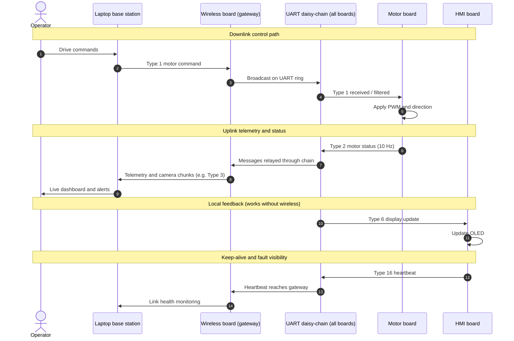

## Part 1: Team Block Diagram Overview

**Figure 1 — Team block diagram (structural / subsystem view).** Each major function lives on its own board; the UART ring ties them together.

Our team’s block diagram was designed using a modular subsystem architecture where each major function (motor control, environmental sensing, navigation, obstacle detection, imaging, wireless communication, and human-machine interface) is implemented on its own board with a dedicated microcontroller and power regulation. Each subsystem is connected through a daisy-chained UART network, allowing each board to manage its own sensors or actuators while relaying data across the system. This structure meets the project requirements by enabling reliable communication, mobility control, sensor feedback, and system monitoring while allowing the rover to remain modular and easily expandable. The Draw.io source for this figure (as a release) is available as [`314 Team 305 Block Diagram`](https://github.com/EGR314-S-2026-30/EGR314-S-2026-305.github.io/releases/download/block_diagram_source_files/314.Team.305.Block.Diagram.drawio).

## Part 2: Team Communication

**Figure 2 — Team communication diagram (UML-style communication view).** This figure complements Figure 1 by emphasizing which subsystems exchange which categories of messages.

The team communication structure uses standardized UART messages to exchange data between subsystems. Sensor boards send periodic updates, the camera subsystem sends frame data and status messages, and the human-machine interface sends display commands and receives status updates. The data travels through the daisy chained network so each subsystem can read the data it needs and pass the message to the next board. The wireless communication board serves as the gateway between the rover and users, transmitting data and receiving control commands. The Draw.io source for Figure 2 is available as [`Team.Communication.drawio`](https://github.com/EGR314-S-2026-30/EGR314-S-2026-305.github.io/releases/download/block_diagram_source_files/Team.Communication.drawio) (release asset).

## UML sequence diagram (representative communication sequence)

The diagram below is a **UML sequence diagram** for a typical operator session. It is consistent with Figures 1–2: control and telemetry use the message types summarized later in this page (for example, Type 1 / Type 2 for motor command and status, Type 6 for the local display, Type 16 for heartbeat).

**Figure 3 — UML sequence diagram (representative end-to-end exchange).**

## Part 3: Message Type Table

| Message Type (uint16_t) | Description |
|--------------------------|-------------|
| 1  | Motor Control State Report |
| 2  | Motor Status Report |
| 3  | Camera Frame Data Packet |
| 4  | Camera Status Report |
| 5  | Gyroscope Data Report |
| 6  | LCD Display Data Report |
| 7  | LCD Status Report |
| 8  | Temperature Sensor Data Report |
| 9  | Light Sensor Data Report |
| 10 | Barometric Pressure Sensor Data Report |
| 11 | Humidity Sensor Data Report |
| 12 | Distance Sensor Data Report |
| 13 | System Status Report |
| 14 | System Error Code Report |
| 15 | Debug Message (String) |
| 16 | Heartbeat / Alive Signal |

# Message Type Structure

## Message Type 1 – Motor Control State Report

| Payload Byte | Type      | Description |
|--------------|----------|-------------|
| 1–2 | uint16_t | 1 |
| 3–4 | int16_t  | Left Motor Speed (PWM) |
| 5–6 | int16_t  | Right Motor Speed (PWM) |
| 7   | uint8_t  | Left Motor Direction (0=Rev,1=Fwd) |
| 8   | uint8_t  | Right Motor Direction |

## Message Type 2 – Motor Status Report

| Payload Byte | Type | Description |
|--------------|------|-------------|
| 1–2 | uint16_t | 2 |
| 3–4 | uint16_t | Left Motor Current (mA) |
| 5–6 | uint16_t | Right Motor Current (mA) |
| 7 | uint8_t | Left Motor Status Code |
| 8 | uint8_t | Right Motor Status Code |

## Message Type 3 – Camera Frame Data Packet

| Payload Byte | Type | Description |
|--------------|------|-------------|
| 1–2 | uint16_t | 3 |
| 3–4 | uint16_t | Frame ID |
| 5–6 | uint16_t | Packet Index |
| 7–8 | uint16_t | Total Packets in Frame |
| 9–58 | uint8_t[] | Image Data Chunk (50 bytes) |

## Message Type 4 – Camera Status Report

| Payload Byte | Type | Description |
|--------------|------|-------------|
| 1–2 | uint16_t | 4 |
| 3 | uint8_t | Camera State (0=Off,1=Idle,2=Capturing) |
| 4–5 | uint16_t | Frame Width |
| 6–7 | uint16_t | Frame Height |
| 8 | uint8_t | Error Code |

## Message Type 5 – Gyroscope Data Report

| Payload Byte | Type | Description |
|--------------|------|-------------|
| 1–2 | uint16_t | 5 |
| 3–6 | float | Angular Velocity X (rad/s) |
| 7–10 | float | Angular Velocity Y |
| 11–14 | float | Angular Velocity Z |

## Message Type 6 – LCD Display Data Report

| Payload Byte | Type | Description |
|--------------|------|-------------|
| 1–2 | uint16_t | 6 |
| 3–58 | char[] | Display Text (Null-terminated, max 55 chars) |

## Message Type 7 – LCD Status Report

| Payload Byte | Type | Description |
|--------------|------|-------------|
| 1–2 | uint16_t | 7 |
| 3 | uint8_t | LCD Power State |
| 4 | uint8_t | Backlight Level |
| 5 | uint8_t | Error Code |

## Message Type 8 – Temperature Sensor Data Report

| Payload Byte | Type | Description |
|--------------|------|-------------|
| 1–2 | uint16_t | 8 |
| 3–6 | float | Temperature (°C) |

## Message Type 9 – Light Sensor Data Report

| Payload Byte | Type | Description |
|--------------|------|-------------|
| 1–2 | uint16_t | 9 |
| 3–6 | float | Light Intensity (lux) |

## Message Type 10 – Barometric Pressure Sensor Data Report

| Payload Byte | Type | Description |
|--------------|------|-------------|
| 1–2 | uint16_t | 10 |
| 3–6 | float | Pressure (Pa) |
| 7–10 | float | Estimated Altitude (m) |

## Message Type 11 – Humidity Sensor Data Report

| Payload Byte | Type | Description |
|--------------|------|-------------|
| 1–2 | uint16_t | 11 |
| 3–6 | float | Relative Humidity (%) |

## Message Type 12 – Distance Sensor Data Report

| Payload Byte | Type | Description |
|--------------|------|-------------|
| 1–2 | uint16_t | 12 |
| 3–6 | float | Distance (meters) |

## Message Type 13 – System Status Report

| Payload Byte | Type | Description |
|--------------|------|-------------|
| 1–2 | uint16_t | 13 |
| 3 | uint8_t | System State |
| 4–7 | uint32_t | Uptime (ms) |
| 8–9 | uint16_t | Battery Voltage (mV) |

## Message Type 14 – System Error Code Report

| Payload Byte | Type | Description |
|--------------|------|-------------|
| 1–2 | uint16_t | 14 |
| 3 | uint8_t | Subsystem ID |
| 4 | uint8_t | Error Code |

## Message Type 15 – Debug Message (String)

| Payload Byte | Type | Description |
|--------------|------|-------------|
| 1–2 | uint16_t | 15 |
| 3–58 | char[] | Debug String (Null-terminated, max 55 chars) |

## Message Type 16 – Heartbeat / Alive Signal

| Payload Byte | Type | Description |
|--------------|------|-------------|
| 1–2 | uint16_t | 16 |
| 3 | uint8_t | System State |
| 4 | uint8_t | Error Flag |

## How the Communication Sequence Satisfies User Needs and Product Requirements

The following discussion refers to **Figure 1** (where each subsystem lives), **Figure 2** (how messages move between those subsystems), and **Figure 3** (time-ordered exchanges for control, telemetry, local HMI, and heartbeat). Together they show how protocol behavior implements the product requirements.

The communication sequence was designed so that every major user need maps directly to one or more message types in the UART daisy-chain network.
Remote situational awareness is satisfied through continuous periodic transmission of Message Types 8–12, which stream temperature, humidity, pressure, light, and distance readings to the wireless board and on to the base station — giving the operator a live picture of the rover's environment without manual requests.
Safe navigation is handled through the relationship between the distance sensor (Type 12) and motor control (Type 1). When an obstacle is detected within threshold, the data propagates through the chain and can trigger an automatic slow or stop, satisfying the hazard avoidance requirement. The HMI board simultaneously updates the OLED display via Type 6 to alert the operator.
Operator control reliability is supported by the two-way structure of the system. Motor commands arrive from the base station as Type 1 packets, and Motor Status Reports (Type 2) flow back confirming execution — giving the operator confidence the rover is responding correctly.
System health is covered by Types 13–16. The System Status Report (Type 13) carries battery voltage and uptime, the Error Code Report (Type 14) lets any subsystem flag a fault, and the Heartbeat (Type 16) lets the base station detect a dropout and trigger a fail-safe — satisfying the safety and power management requirements.
Finally, the local HMI satisfies the need for on-rover feedback independent of the wireless link. Even if the wireless connection is lost, the OLED continues receiving updates through the daisy-chain, ensuring the rover never operates completely without feedback.

## Message Structure Design and Decision-Making Process

The decisions below align the on-wire layout with **Figures 1–3**: fixed headers so any board on the ring can parse quickly, small payloads so the timelines in **Figure 3** stay responsive, and chunked camera data so one subsystem cannot monopolize the bus implied by **Figure 2**.

The message structure was built around three constraints: limited UART bandwidth, the need for each board to filter only relevant messages, and keeping the system expandable.
Every message begins with a fixed uint16_t type field. Each board reads these first two bytes to decide whether to act on the message or pass it along. A 16-bit field gives room for future expansion without restructuring the protocol. An addressed source-destination scheme was considered but rejected — in a daisy-chain topology where all boards see all traffic, it added complexity without a real benefit.
Payload sizes were kept small intentionally. Most sensor messages carry just a 2-byte type header and a 4-byte float, keeping each message focused on a single data source. This meant boards could be developed and tested independently, which was important with seven team members working on separate boards.
The camera packet (Type 3) was the most complex decision. Streaming video over UART requires chunking frames into 50-byte segments with a Frame ID and Packet Index so the receiver can reassemble them in order. The 50-byte size was chosen to avoid blocking the bus for too long while still making meaningful progress per transmission.
The Heartbeat (Type 16) and Debug message (Type 15) were both added during development rather than planned from the start — the heartbeat to distinguish genuine faults from low-activity periods, and the debug message to let boards broadcast readable strings to the base station during integration testing without needing a separate debugger on each board.

## Top 5 Software Design Changes Since the Software Proposal

The items below are grounded in the **UML-related figures above**: Figure 1 shows modular boards on one UART ring; Figure 2 shows message-oriented connectivity; Figure 3 shows how control, telemetry, display, and heartbeat traffic interleave in time. The **message type tables** in Part 3 document the final wire format after each change.

1. **Broadcast filtering replaced addressed messaging.**  
   **Figure 2** shows every subsystem on the same logical bus; the original proposal instead used source–destination address fields on every packet. During integration, maintaining address tables across seven independently developed boards created version-control headaches — a change on one board required coordinated updates everywhere. The team switched to a broadcast model where each board sees all traffic and filters by the leading `uint16_t` message type only. As **Figure 1** still shows one ring, the structural diagram did not change, but the communication view in **Figure 2** and the lifeline interactions in **Figure 3** now assume type-based filtering rather than per-link addressing. This simplified firmware and made adding a subsystem a matter of defining a new type in the tables below.

2. **Heartbeat message added.**  
   The early software proposal had no keep-alive. During bench testing, the base station could not distinguish a quiet but healthy bus from a failed link, which produced false disconnection warnings. The team added **Message Type 16**, a periodic heartbeat (see Part 3), originating from the HMI path and visible on the gateway lifeline in **Figure 3**. The base station now treats sustained loss of Type 16 as the definitive failure signal. This change does not alter the block topology in **Figure 1**, but it adds a sustained vertical flow of small packets in the sequence view so health checks stay orthogonal to bursty camera traffic.

3. **Motor status changed from event-driven to continuous.**  
   Originally the motor board emitted **Type 2** only when values changed. After a short dropout or a fresh connection, **Figure 3**’s uplink could therefore show long gaps with no motor confirmation even though the rover was moving. The team changed **Type 2** to a fixed **10 Hz** stream so the operator always receives motion state within about 100 ms of reconnecting. That steady cadence is what the “Uplink telemetry and status” segment in **Figure 3** is meant to suggest; **Figure 2** still depicts the motor board as the actuator path for mobility requirements.

4. **Environmental sensors split into individual message types.**  
   The proposal packed temperature, humidity, pressure, and light into one composite environmental packet to save bandwidth. In hardware, those sensors sat on different boards with different sampling rates and owners, so a single “collector” board would have had to poll neighbors before transmitting — contradicting the independence implied by **Figure 1**. The team split the stream into **Types 8–11**, each produced by its own board and forwarded on the same ring shown in **Figure 2**. The sequence diagram (**Figure 3**) stays representative rather than enumerating every sensor message, but the tables in Part 3 are the authoritative list of those parallel periodic streams to the wireless gateway.

5. **Camera transmission changed to chunked packets.**  
   The proposal assumed one large UART frame per JPEG. On the shared ring in **Figures 1–2**, those bursts stalled **Type 1** / **Type 12** traffic long enough to violate hazard-avoidance and control responsiveness. The team redesigned **Type 3** as **50-byte** chunks with **Frame ID** and **Packet Index** (Part 3) so image data interleaves with other messages. **Figure 3** calls out “camera chunks” on the uplink to reflect that interleaving; the communication diagram (**Figure 2**) remains the high-level view of the camera subsystem feeding the same gateway as motor and sensor data.

