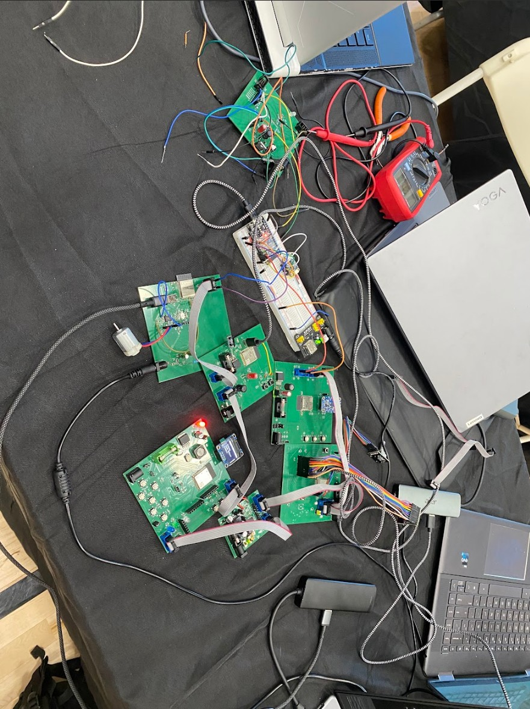

## Overview

The initial prototype was designed as a distributed embedded system consisting of seven independent ESP32-based subsystems. Each board handled a specific sensor, actuator, or communication task.

All boards were connected using ribbon cables and communicated via UART which allowed data transfer between subsystems without a central controller.

---

## Innovation showcase poster

**JPG (in repository):** the poster image below is served from `docs/06-Prototype/assets/innovation-showcase-poster.jpg`. Replace that file if you update the poster design.

[](assets/innovation-showcase-poster.jpg)

**PDF:** add your printable poster to the same folder and keep the filename below, or change the link after you upload (for example to Google Drive or a release asset).

[Download innovation showcase poster (PDF)](assets/innovation-showcase-poster.pdf)

If the PDF link returns 404, export your poster as PDF, save it as `innovation-showcase-poster.pdf` in [`assets/`](assets/README.txt), commit, and push. See `assets/README.txt` for a short checklist.

---

## Final system — integrated hardware

The following images document the **final integrated state** of the rover (hardware and software running together). Add more files under `docs/06-Prototype/assets/` and duplicate the markdown pattern if you need additional angles.



---

## Demo videos (YouTube embeds)

Upload each clip to **YouTube**, open the video → **Share** → **Embed**, and copy the `iframe` from the dialog. Paste the full `<iframe>...</iframe>` block into this page (Material for MkDocs allows raw HTML in markdown).

### Team overview and design process

This embed uses the same video linked from the [Team Video](../07-Team-Video/Team-Video.md) page.

<iframe width="560" height="315" src="https://www.youtube.com/embed/PIl7PPt0aks" title="Team 305 — team video" frameborder="0" allow="accelerometer; autoplay; clipboard-write; encrypted-media; gyroscope; picture-in-picture; web-share" referrerpolicy="strict-origin-when-cross-origin" allowfullscreen></iframe>

### Final system — functionality walkthrough

After you upload a walkthrough (driving, telemetry, obstacle behavior, base station UI, and so on), paste the full `<iframe>...</iframe>` from YouTube **Embed** here, or copy the template and set `YOUR_VIDEO_ID` to the value after `v=` in the watch URL:

```html
<iframe width="560" height="315" src="https://www.youtube.com/embed/YOUR_VIDEO_ID" title="Team 305 — final demo" frameborder="0" allow="accelerometer; autoplay; clipboard-write; encrypted-media; gyroscope; picture-in-picture; web-share" referrerpolicy="strict-origin-when-cross-origin" allowfullscreen></iframe>
```

To show several clips on one page, repeat a pasted `<iframe>` block once per video (each with its own `src` / title).

---

## Early prototype setup


## System architecture

The prototype included the following subsystems:

- Distance Sensor 
- Temperature Sensor
- Camera Module
- Motor Control System
- LCD Display
- MQTT Communication Module
- Power Distribution

Each subsystem operated independently while sharing data across the system.

## Communication

UART was used for communication between boards:

- TX and RX connections between subsystems  
- Common ground shared across all boards  

Ribbon cables were used for flexible connections during testing and integration.

## Power distribution

All boards were powered from a shared source, with local regulation to 5V and 3.3V on each subsystem.

Power stability became a key issue during integration, especially with multiple active boards.

## Challenges

ESP32 Flashing

- Inconsistent firmware uploads  
- Boot mode and connection issues  

Communication

- Data inconsistencies between boards  
- Difficulty managing multiple UART connections  

Sensor Integration

- Devices detected but not returning valid data  
- Pin configuration and communication conflicts  

Power

- Voltage drops across the system  
- Unstable behavior under load  

## Key takeaways

- Reliable communication requires structured design  
- Power distribution is critical in multi-board systems  
- Hardware and firmware debugging must be done together  
- System integration introduces complexity beyond individual subsystems  

## Transition to final design

These challenges led to improvements in communication structure, power stability, and overall system integration for the final design. The current UART message protocol, block diagram, and communication diagrams are documented on the [Team block diagram and protocol](../04-Team-Block-Diagram/Team-Diagram.md) page.
